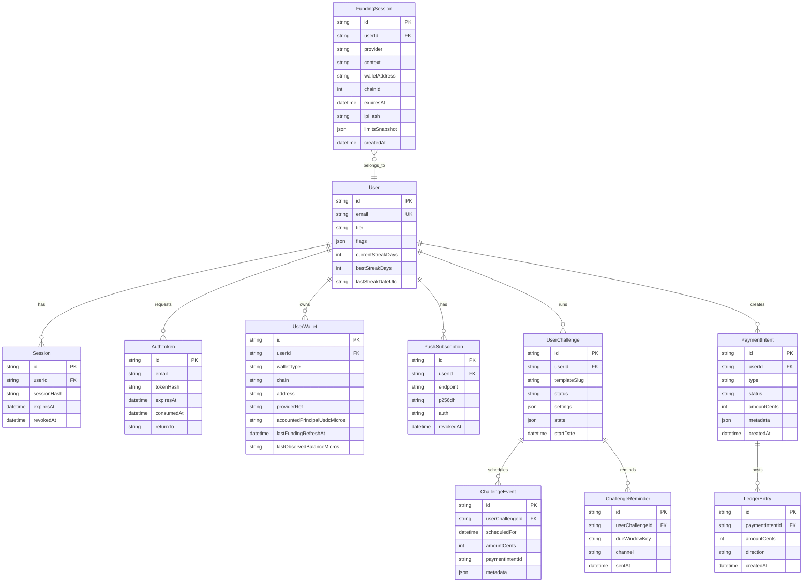

# ERD (Mermaid)

> This ERD is “conceptual but close to Prisma.” Some columns omitted for brevity, but relationships and key tables are accurate.

```mermaid
erDiagram
  User ||--o{ Session : has
  User ||--o{ AuthToken : requests
  User ||--o{ UserWallet : owns
  User ||--o{ PushSubscription : has
  User ||--o{ UserChallenge : runs
  User ||--o{ PaymentIntent : creates

  UserChallenge ||--o{ ChallengeEvent : schedules
  UserChallenge ||--o{ ChallengeReminder : reminds
  PaymentIntent ||--o{ LedgerEntry : posts
  FundingSession }o--|| User : belongs_to

  User {
    string id PK
    string email UK
    string tier
    json flags
    int currentStreakDays
    int bestStreakDays
    string lastStreakDateUtc
  }

  Session {
    string id PK
    string userId FK
    string sessionHash
    datetime expiresAt
    datetime revokedAt
  }

  AuthToken {
    string id PK
    string email
    string tokenHash
    datetime expiresAt
    datetime consumedAt
    string returnTo
  }

  UserWallet {
    string id PK
    string userId FK
    string walletType
    string chain
    string address
    string providerRef
    string accountedPrincipalUsdcMicros
    datetime lastFundingRefreshAt
    string lastObservedBalanceMicros
  }

  FundingSession {
    string id PK
    string userId FK
    string provider
    string context
    string walletAddress
    int chainId
    datetime expiresAt
    string ipHash
    json limitsSnapshot
    datetime createdAt
  }

  PushSubscription {
    string id PK
    string userId FK
    string endpoint
    string p256dh
    string auth
    datetime revokedAt
  }

  UserChallenge {
    string id PK
    string userId FK
    string templateSlug
    string status
    json settings
    json state
    datetime startDate
  }

  ChallengeEvent {
    string id PK
    string userChallengeId FK
    datetime scheduledFor
    int amountCents
    string paymentIntentId
    json metadata
  }

  ChallengeReminder {
    string id PK
    string userChallengeId FK
    string dueWindowKey
    string channel
    datetime sentAt
  }

  PaymentIntent {
    string id PK
    string userId FK
    string type
    string status
    int amountCents
    json metadata
    datetime createdAt
  }

  LedgerEntry {
    string id PK
    string paymentIntentId FK
    int amountCents
    string direction
    datetime createdAt
  }
```
