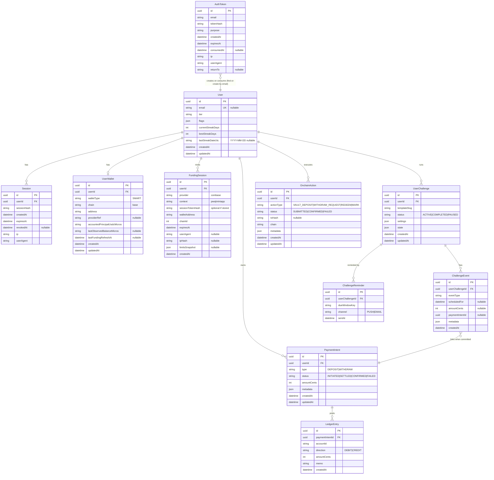

# Entity-Relationship Diagram – StashJar

Uses Mermaid ER diagrams. Renders automatically on GitHub.

```mermaid
erDiagram
  User {
    uuid id PK
    string email UK "nullable"
    string tier
    json flags
    int currentStreakDays
    int bestStreakDays
    string lastStreakDateUtc "YYYY-MM-DD nullable"
    datetime createdAt
    datetime updatedAt
  }

  Session {
    uuid id PK
    uuid userId FK
    string sessionHash
    datetime createdAt
    datetime expiresAt
    datetime revokedAt "nullable"
    string ip
    string userAgent
  }

  AuthToken {
    uuid id PK
    string email
    string tokenHash
    string purpose
    datetime createdAt
    datetime expiresAt
    datetime consumedAt "nullable"
    string ip
    string userAgent
    string returnTo "nullable"
  }

  UserWallet {
    uuid id PK
    uuid userId FK
    string walletType "SMART"
    string chain "base"
    string address
    string providerRef "nullable"
    string accountedPrincipalUsdcMicros
    string lastObservedBalanceMicros "nullable"
    datetime lastFundingRefreshAt "nullable"
    datetime createdAt
    datetime updatedAt
  }

  FundingSession {
    uuid id PK
    uuid userId FK
    string provider "coinbase"
    string context "pwa|miniapp"
    string sessionTokenHash "optional if stored"
    string walletAddress
    int chainId
    datetime expiresAt
    string userAgent "nullable"
    string ipHash "nullable"
    json limitsSnapshot "nullable"
    datetime createdAt
  }

  UserChallenge {
    uuid id PK
    uuid userId FK
    string templateSlug
    string status "ACTIVE|COMPLETED|PAUSED"
    json settings
    json state
    datetime createdAt
    datetime updatedAt
  }

  ChallengeEvent {
    uuid id PK
    uuid userChallengeId FK
    string eventType
    datetime scheduledFor "nullable"
    int amountCents "nullable"
    uuid paymentIntentId "nullable"
    json metadata
    datetime createdAt
  }

  ChallengeReminder {
    uuid id PK
    uuid userChallengeId FK
    string dueWindowKey
    string channel "PUSH|EMAIL"
    datetime sentAt
  }

  PaymentIntent {
    uuid id PK
    uuid userId FK
    string type "DEPOSIT|WITHDRAW"
    string status "INITIATED|SETTLED|CONFIRMED|FAILED"
    int amountCents
    json metadata
    datetime createdAt
    datetime updatedAt
  }

  LedgerEntry {
    uuid id PK
    uuid paymentIntentId FK
    string accountId
    string direction "DEBIT|CREDIT"
    int amountCents
    string memo
    datetime createdAt
  }

  OnchainAction {
    uuid id PK
    uuid userId FK
    string actionType "VAULT_DEPOSIT|WITHDRAW_REQUEST|REDEEM|MARK"
    string status "SUBMITTED|CONFIRMED|FAILED"
    string txHash "nullable"
    string chain
    json metadata
    datetime createdAt
    datetime updatedAt
  }

  User ||--o{ Session : "has"
  AuthToken }o--|| User : "creates on consume (find-or-create by email)"
  User ||--o| UserWallet : "has"
  User ||--o{ FundingSession : "mints"
  User ||--o{ UserChallenge : "runs"
  UserChallenge ||--o{ ChallengeEvent : "has"
  UserChallenge ||--o{ ChallengeReminder : "reminded by"
  User ||--o{ PaymentIntent : "owns"
  PaymentIntent ||--o{ LedgerEntry : "posts"
  User ||--o{ OnchainAction : "executes"
  ChallengeEvent }o--|| PaymentIntent : "links when committed"
```
