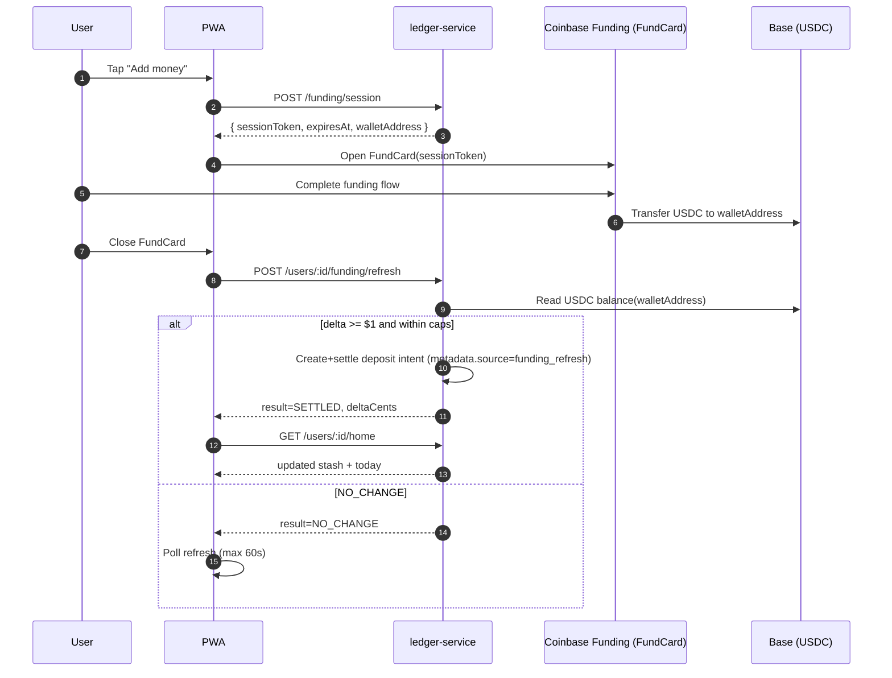
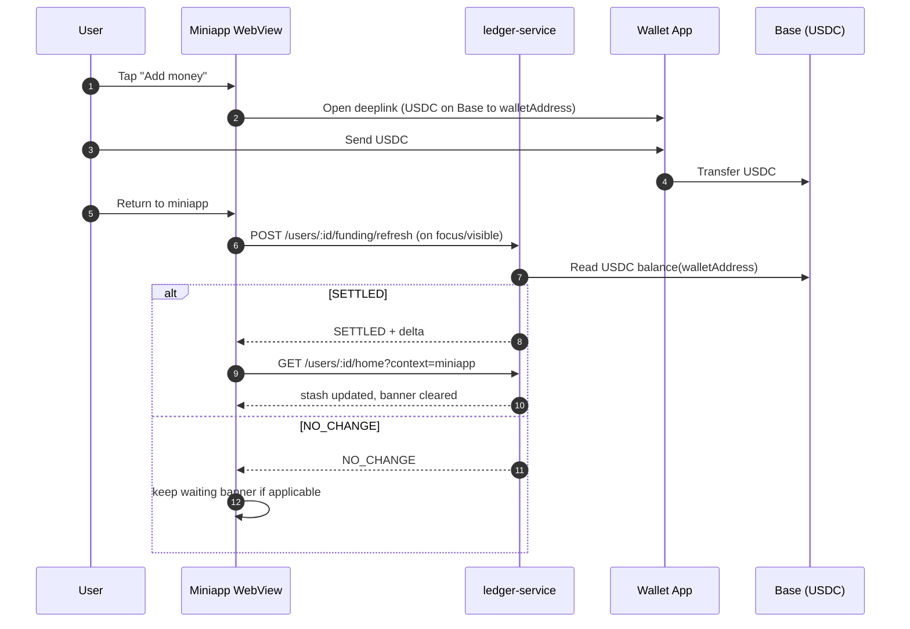
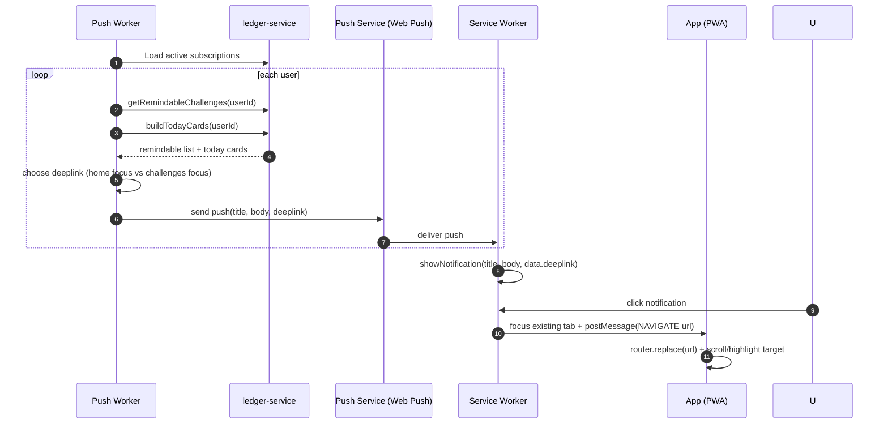

# Sequence Diagrams (Mermaid)

## Funding (PWA FundCard -> refresh bridge)

```mermaid
sequenceDiagram
  autonumber
  participant U as User
  participant P as PWA
  participant L as ledger-service
  participant C as Coinbase Funding (FundCard)
  participant B as Base (USDC)

  U->>P: Tap "Add money"
  P->>L: POST /funding/session
  L-->>P: { sessionToken, expiresAt, walletAddress }
  P->>C: Open FundCard(sessionToken)
  U->>C: Complete funding flow
  C->>B: Transfer USDC to walletAddress
  U->>P: Close FundCard
  P->>L: POST /users/:id/funding/refresh
  L->>B: Read USDC balance(walletAddress)
  alt delta >= $1 and within caps
    L->>L: Create+settle deposit intent (metadata.source=funding_refresh)
    L-->>P: result=SETTLED, deltaCents
    P->>L: GET /users/:id/home
    L-->>P: updated stash + today
  else NO_CHANGE
    L-->>P: result=NO_CHANGE
    P->>P: Poll refresh (max 60s)
  end
```

## Funding (Miniapp open-in-wallet -> return -> refresh)

```mermaid
sequenceDiagram
  autonumber
  participant U as User
  participant M as Miniapp WebView
  participant L as ledger-service
  participant W as Wallet App
  participant B as Base (USDC)

  U->>M: Tap "Add money"
  M->>W: Open deeplink (USDC on Base to walletAddress)
  U->>W: Send USDC
  W->>B: Transfer USDC
  U->>M: Return to miniapp
  M->>L: POST /users/:id/funding/refresh (on focus/visible)
  L->>B: Read USDC balance(walletAddress)
  alt SETTLED
    L-->>M: SETTLED + delta
    M->>L: GET /users/:id/home?context=miniapp
    L-->>M: stash updated, banner cleared
  else NO_CHANGE
    L-->>M: NO_CHANGE
    M->>M: keep waiting banner if applicable
  end
```

## Push reminder (due-window driven)

```mermaid
sequenceDiagram
  autonumber
  participant J as Push Worker
  participant L as ledger-service
  participant P as Push Service (Web Push)
  participant SW as Service Worker
  participant A as App (PWA)

  J->>L: Load active subscriptions
  loop each user
    J->>L: getRemindableChallenges(userId)
    J->>L: buildTodayCards(userId)
    L-->>J: remindable list + today cards
    J->>J: choose deeplink (home focus vs challenges focus)
    J->>P: send push(title, body, deeplink)
    P->>SW: deliver push
  end

  SW->>SW: showNotification(title, body, data.deeplink)
  U->>SW: click notification
  SW->>A: focus existing tab + postMessage(NAVIGATE url)
  A->>A: router.replace(url) + scroll/highlight target
```
