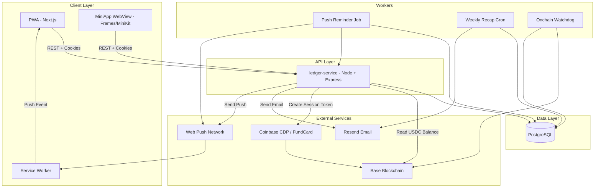

# System Architecture Overview – StashJar

Below is a system-level architecture diagram.

## Architecture Notes

**Client Layer** — Same app serves PWA + MiniApp. Mode driven by server context. Service Worker handles push + navigation.

**API Layer** — Single source of truth for: funding rails, limits, tier permissions, challenge due windows, idempotent ledger entries.

**Workers** — Push reminder job, weekly recap cron, onchain watchdog.

**Data** — Postgres is authoritative. Ledger integrity verified via `/debug/health/ledger`.

**External Systems** — Coinbase CDP for funding sessions; Base for USDC balances; Resend for email; Web Push network for notifications.
