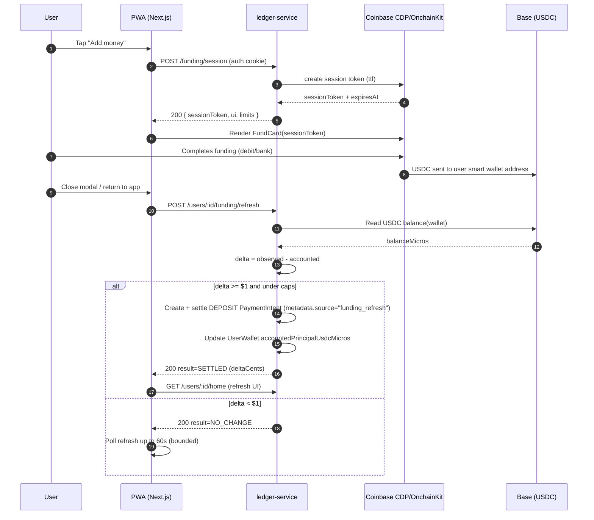
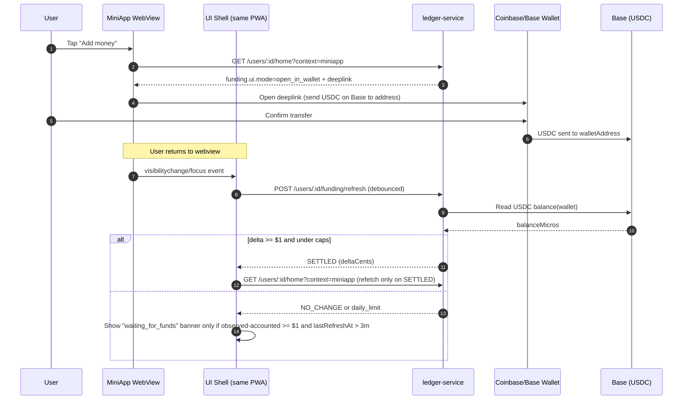
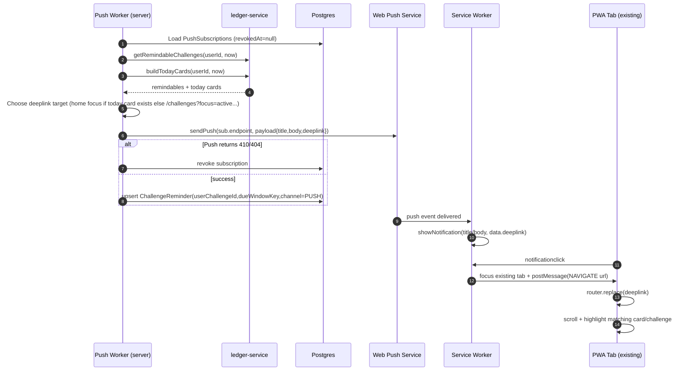

# Sequence Diagrams – StashJar

## Funding Flow (PWA – FundCard rail)

```mermaid
sequenceDiagram
  autonumber
  participant U as User
  participant PWA as PWA (Next.js)
  participant API as ledger-service
  participant CDP as Coinbase CDP/OnchainKit
  participant CH as Base (USDC)

  U->>PWA: Tap "Add money"
  PWA->>API: POST /funding/session (auth cookie)
  API->>CDP: create session token (ttl)
  CDP-->>API: sessionToken + expiresAt
  API-->>PWA: 200 { sessionToken, ui, limits }

  PWA->>CDP: Render FundCard(sessionToken)
  U->>CDP: Completes funding (debit/bank)
  CDP->>CH: USDC sent to user smart wallet address

  U->>PWA: Close modal / return to app
  PWA->>API: POST /users/:id/funding/refresh
  API->>CH: Read USDC balance(wallet)
  CH-->>API: balanceMicros
  API->>API: delta = observed - accounted
  alt delta >= $1 and under caps
    API->>API: Create + settle DEPOSIT PaymentIntent (metadata.source="funding_refresh")
    API->>API: Update UserWallet.accountedPrincipalUsdcMicros
    API-->>PWA: 200 result=SETTLED (deltaCents)
    PWA->>API: GET /users/:id/home (refresh UI)
  else delta < $1
    API-->>PWA: 200 result=NO_CHANGE
    PWA->>PWA: Poll refresh up to 60s (bounded)
  end
```

## Funding Flow (MiniApp – Open in Wallet rail)

```mermaid
sequenceDiagram
  autonumber
  participant U as User
  participant Mini as MiniApp WebView
  participant PWA as UI Shell (same PWA)
  participant API as ledger-service
  participant Wallet as Coinbase/Base Wallet
  participant CH as Base (USDC)

  U->>Mini: Tap "Add money"
  Mini->>API: GET /users/:id/home?context=miniapp
  API-->>Mini: funding.ui.mode=open_in_wallet + deeplink

  Mini->>Wallet: Open deeplink (send USDC on Base to address)
  U->>Wallet: Confirm transfer
  Wallet->>CH: USDC sent to walletAddress

  Note over Mini,PWA: User returns to webview
  Mini->>PWA: visibilitychange/focus event
  PWA->>API: POST /users/:id/funding/refresh (debounced)
  API->>CH: Read USDC balance(wallet)
  CH-->>API: balanceMicros
  alt delta >= $1 and under caps
    API-->>PWA: SETTLED (deltaCents)
    PWA->>API: GET /users/:id/home?context=miniapp (refetch only on SETTLED)
  else
    API-->>PWA: NO_CHANGE or daily_limit
    PWA->>PWA: Show "waiting_for_funds" banner only if observed-accounted >= $1 and lastRefreshAt > 3m
  end
```

## Push Reminder Flow (deep link to best target)

```mermaid
sequenceDiagram
  autonumber
  participant Cron as Push Worker (server)
  participant API as ledger-service
  participant DB as Postgres
  participant Push as Web Push Service
  participant SW as Service Worker
  participant App as PWA Tab (existing)

  Cron->>DB: Load PushSubscriptions (revokedAt=null)
  Cron->>API: getRemindableChallenges(userId, now)
  Cron->>API: buildTodayCards(userId, now)
  API-->>Cron: remindables + today cards
  Cron->>Cron: Choose deeplink target (home focus if today card exists else /challenges?focus=active...)

  Cron->>Push: sendPush(sub.endpoint, payload{title,body,deeplink})
  alt Push returns 410/404
    Cron->>DB: revoke subscription
  else success
    Cron->>DB: upsert ChallengeReminder(userChallengeId,dueWindowKey,channel=PUSH)
  end

  Push->>SW: push event delivered
  SW->>SW: showNotification(title/body, data.deeplink)
  App->>SW: notificationclick
  SW->>App: focus existing tab + postMessage(NAVIGATE url)
  App->>App: router.replace(deeplink)
  App->>App: scroll + highlight matching card/challenge
```
